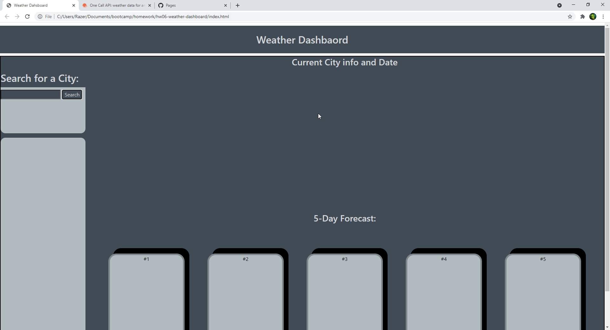
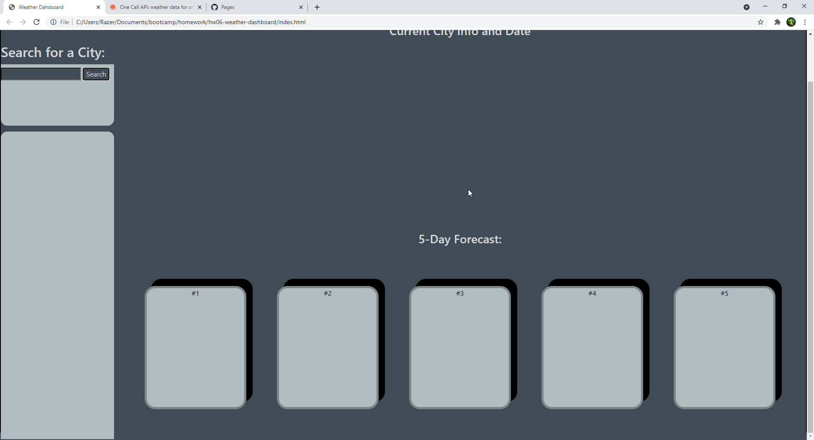

## Hw06-weather-dashboard
# Objective
In this homework we are suppose to use the API to pull the data and display it in the respective spots in the webpage. Then we are suppose to store the previously searched towns in a list below the searched list which I created a whole seperate area for. I had a hard time using bootstrap so I just did standard CSS and some flex to try and get it looking alright.
# Screenshot

# Deployed Page
https://tanneroliver.github.io/hw06-weather-dashboard/