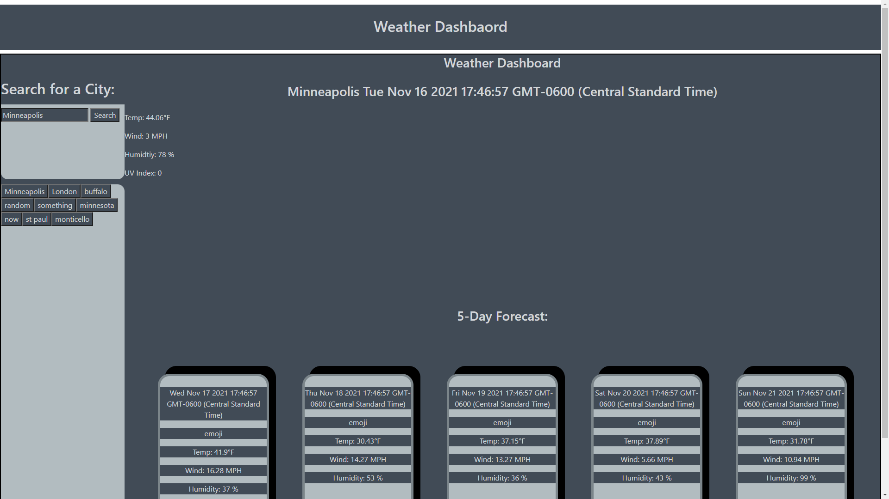

# hw06-Weather Dashboard

## Description

In this application you should be able to search for a cities weather. You should be returned with the current weather and the forecast for the week.

## Table of Contents

- [Installation](#installation)
- [Usage](#usage)
- [License](#license)
- [Contribution](#contribution)
- [Test](#test)
- [Questions](#questions)

## Installation

You should just be able to use it in the browser. Just clone th repo.

## Usage

Search for a city using the search bar. cities you have searched for in the past should show up under that bar.

## License

This project is under the MIT license.

## Contribution

bootstrap, jquery

## Test

Look for weather in different cities.

## Questions

My GitHub is: [TannerOliver](https://github.com/TannerOliver)  
You can reach me at Email: 435.tanner@gmail.com  
Check out the deployed page! [GitHub](https://tanneroliver.github.io/hw06-weather-dashboard/)
